<div align="center">

# Viral Roulette

### Algorithm or Skill? A Monte Carlo simulation of creator strategy and emergent inequality on TikTok


**[Try the interactive demo](https://rayyanmaan.github.io/viral-roulette/)** &nbsp;·&nbsp;
**[Read the report (PDF)](report/viral-roulette-report.pdf)** &nbsp;·&nbsp;
**[Open the notebook](notebooks/viral_roulette.ipynb)** &nbsp;·&nbsp;
**[Jump to results](#results)**

</div>

---

## The question

TikTok is unusual among large platforms because early distribution does not
require an existing audience. A new video is routed to a small cohort of viewers
*before* any follower-graph signal can matter. That makes a question testable
here that is almost untestable elsewhere:

> **Does a creator's strategy actually decide their outcome, or does early
> exposure randomness dominate?**

You cannot randomly assign strategies to real creators, and the ranking system
is not publicly specified, so an empirical-only approach is stuck treating the
platform as a black box. A calibrated simulation lets you hold everything else
fixed and vary only the strategy — which is exactly the comparison the question
needs.

Four strategies are compared over 1,000 independent randomised platform
environments each:

| Strategy | Idea | Mean quality | Quality SD | Trend adaptation | Posts/week |
|---|---|:---:|:---:|:---:|:---:|
| **Niche Specialist** | one topic, forever, consistently | 0.58 | 0.07 | 0.00 | 2 |
| **Trend Chaser** | ride whatever is live, fast and rough | 0.30 | 0.18 | 0.55 | 3 |
| **Quality-Focused** | few posts, high production value | 0.88 | 0.03 | 0.08 | 1 |
| **Random Baseline** | no coherent plan (null condition) | 0.45 | 0.22 | 0.28 | 2 |

---

## The answer, in one paragraph

**Strategy does not change how big you get. It changes *how* you get there, and
how likely you are to lose ground.** Mean final followers land in a band of
13,281–13,351 across all four strategies, with confidence intervals that overlap
almost entirely — a genuine null result on magnitude. But virality separates the
strategies cleanly and with non-overlapping intervals (quality-focused 1.000,
niche 0.399, random 0.198, trend chaser 0.050), and the *survival* ranking
inverts it: the trend chaser is the **most** likely strategy to end the year
ahead (10.6% vs 6.4% for quality-focused), because posting three times a week
buys more independent chances to clear the amplification threshold and offset
churn. Two different definitions of "doing well", two different winners.

<table>
<tr>
<th align="left">Metric</th>
<th>Niche</th>
<th>Trend Chaser</th>
<th>Quality-Focused</th>
<th>Random</th>
<th align="left">Verdict</th>
</tr>
<tr>
<td align="left">Mean final followers</td>
<td align="center">13,296</td><td align="center">13,351</td><td align="center">13,281</td><td align="center">13,282</td>
<td align="left">tied — CIs overlap</td>
</tr>
<tr>
<td align="left">Survival rate</td>
<td align="center">0.0735</td><td align="center"><b>0.1056</b></td><td align="center">0.0640</td><td align="center">0.0655</td>
<td align="left">trend chaser wins</td>
</tr>
<tr>
<td align="left">Viral rate per video</td>
<td align="center">0.3990</td><td align="center">0.0495</td><td align="center"><b>1.0000</b></td><td align="center">0.1980</td>
<td align="left">quality wins, cleanly separated</td>
</tr>
<tr>
<td align="left">Gini (within run)</td>
<td align="center">0.5577</td><td align="center">0.5550</td><td align="center">0.5584</td><td align="center">0.5585</td>
<td align="left">tied — inequality is structural</td>
</tr>
</table>

<p align="center">
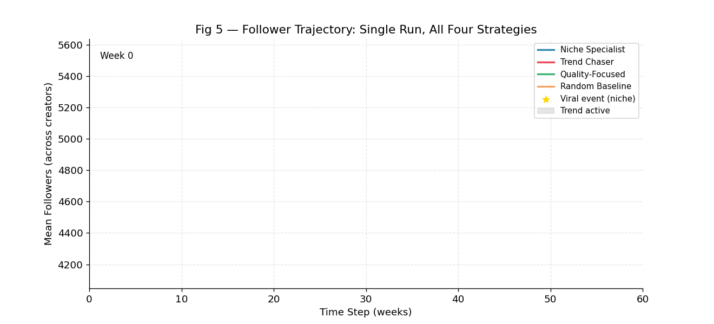
<br><em>One run, 60 weeks. All four strategies drift down under churn; the trend chaser drifts slowest.</em>
</p>

---

## Try it in the browser

**[rayyanmaan.github.io/viral-roulette](https://rayyanmaan.github.io/viral-roulette/)** — *The Amplification Gate*
is a live bench test of the funnel. Drag a video's production quality, pick a topic, switch a trend on, and
2,000 test cohorts are simulated in the browser using the model's real equations. Watch the score distribution
slide across the `E = 0.35` gate and the amplification probability move with it.

---

## Contents

- [How the model works](#how-the-model-works)
- [Calibration: where every number comes from](#calibration-where-every-number-comes-from)
- [Theory](#theory)
- [Correctness](#correctness)
- [Results](#results)
  - [Experiment 1 — follower growth](#experiment-1--follower-growth-distributions)
  - [Experiment 2 — survival](#experiment-2--survival-and-downside-risk)
  - [Experiment 3 — virality vs theory](#experiment-3--virality-simulation-vs-theory)
  - [Follow-up — is virality the mechanism?](#follow-up--is-virality-actually-the-mechanism)
  - [Experiment 4 — inequality](#experiment-4--inequality)
  - [Experiment 5 — sensitivity](#experiment-5--sensitivity)
  - [Confidence intervals](#confidence-intervals-as-a-result-not-a-footnote)
- [What this model cannot tell you](#what-this-model-cannot-tell-you)
- [Reproducing it](#reproducing-it)
- [Repository map](#repository-map)
- [References](#references)

---

## How the model works

Three components, one weekly loop. The goal was never to reimplement a real
ranking stack — it was to build the smallest system that still has the property
that matters: **everyone gets a first audience, and what happens next feeds
back.**

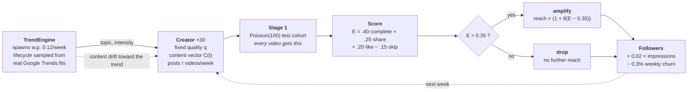

**Why the pieces are shaped this way**

- **Stage 1 is unconditional.** Every video, from every creator, gets a fresh
  Poisson-distributed cohort of roughly 100 viewers. This is the model's
  irreducible exposure luck, and it is the whole reason the question is
  interesting: the platform hands out a lottery ticket per post.
- **Amplification is a hard threshold.** Clear `E > 0.35` and reach expands
  linearly in how far you cleared it; miss and the video stops dead. A soft
  ranking score would have blurred exactly the effect under study.
- **Creators start with real follower stocks**, drawn from published tier shares
  (88.7% nano, 8.9% micro, 2.2% mid-tier, 0.2% macro) rather than from zero.
  This turns out to drive the headline null result, and the report argues that
  at length rather than hiding it.
- **Quality is fixed within a run.** No learning. That is a deliberate
  restriction so that strategy effects are not confounded with skill
  acquisition — and it is the first limitation listed below.

<details>
<summary><b>The engagement score, in full</b></summary>

For a cohort of `n` viewers, each of four behaviours is an independent Bernoulli
draw whose probability depends on video quality `q` and the topic multipliers:

```
p_complete = sigmoid(6(q - 0.5))
p_like     = clip(q * m_like(topic)  * 0.1478 * 35.0,              0, 0.95)
p_share    = clip(q * m_share(topic) * 0.0041 * 21.0 * trend_boost, 0, 0.95)
p_skip     = clip(1 - 0.9q,                                     0.05, 0.95)
```

with `trend_boost = 1.4` when the video rides the live trend. The score is the
weighted empirical rate,

```
E = 0.40 * p̂_complete + 0.25 * p̂_share + 0.20 * p̂_like - 0.15 * p̂_skip
```

Completion outranks shares, shares outrank likes, skips subtract. Those weights
are an architectural choice motivated by watch-time priority — they are stated
as part of the model definition rather than passed off as estimated, and they
are held fixed across every experiment.

The scale factors `35.0` and `21.0` are *solved for*, not picked: they are
chosen so that an average video (`q = 0.5`) scores `E ≈ 0.32`, just **below**
the 0.35 threshold. If average content cleared the bar by default, there would
be no strategy trade-off left to measure.

</details>

---

## Calibration: where every number comes from

Four datasets. Nothing in the model is a free-floating constant, and
[`data/README.md`](data/README.md) tracks each file to the appendix that
consumes it.

| Source | Contributes | Result |
|---|---|---|
| **Bright Data** TikTok user profiles (1,000 creators) | The inequality target the simulation is graded against | `G_real = 0.9086`, follower range 1 → 14.5M |
| **Kaggle** TikTok popular hashtags (1,200 videos, CC0) | Per-topic like/share multipliers; funnel scale factors | baseline like 0.1478, share 0.0041, 12 topics |
| **Google Trends** ×4 real TikTok trends | A family of plausible trend lifecycle shapes | four fitted (μ, σ) pairs |
| **HypeAuditor** *State of Influencer Marketing 2026* | Creator-tier population shares and engagement benchmarks | tier distribution for initialisation |

<table>
<tr><td width="50%">

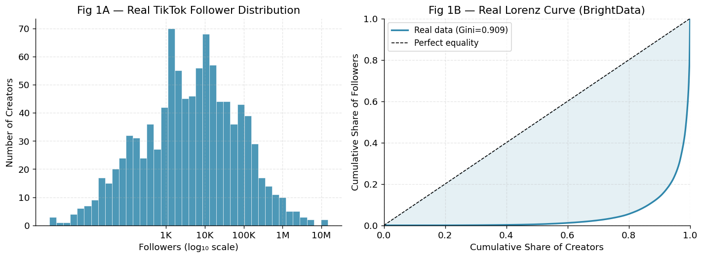

**Fig 1 — the calibration target.** Real follower inequality is extreme: the
Lorenz curve hugs the axis for most of the creator population and only lifts in
the top tail. `G_real = 0.9086`.

</td><td width="50%">

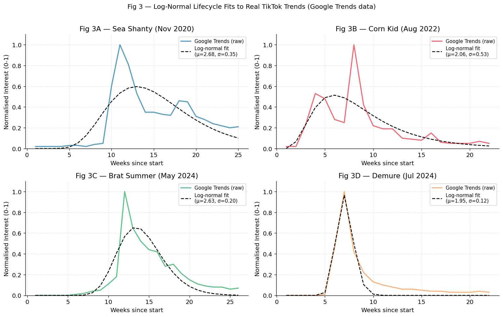

**Fig 3 — trend lifecycles.** Log-normal fits to Sea Shanty, Corn Kid, Brat
Summer and Demure. The fits do not reconstruct each trend exactly, and do not
need to — they supply a *distribution of shapes* for the engine to sample.

</td></tr>
</table>

<p align="center">
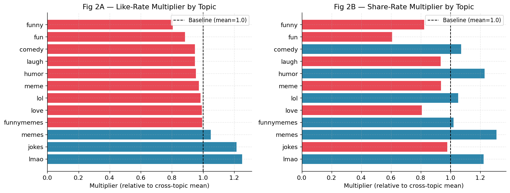
</p>

**Fig 2 — topic multipliers, and why there are two of them.** Like multipliers
and share multipliers rank topics *differently*: `memes` tops the share ranking
(~1.3) while `lmao` and `jokes` top the like ranking. Keeping both prevents the
model from collapsing topic choice into a single scalar "good topic" dimension.

---

## Theory

The simulation is checked against closed-form results rather than just described.
All four are implemented in [`src/viral_roulette/theory.py`](src/viral_roulette/theory.py).

**1. Virality probability.** Each engagement component is a scaled Binomial, so
`E[p̂_j] = p_j` and `Var(p̂_j) = p_j(1-p_j)/n`. With `n = 100`, a normal
approximation to the weighted sum gives

```
P(viral) = P(E > θ) ≈ 1 - Φ( (θ - E[E]) / √Var(E) )
```

**2. Why follower distributions go log-normal.** Growth is multiplicative, so
`log F(T) = log F(0) + Σ log(1 + δ_t)`. If those increments have finite variance
and weak dependence, the sum is approximately normal by a CLT argument, making
`F(T)` approximately log-normal — for which the Gini has the closed form
`G = 2Φ(σ_logF / √2) - 1`.

**3. Recovery time after a trend.** Residual content drift decays geometrically,
`d(k) = d₀(1-η)^k`, so `k* = log(ε/d₀) / log(1-η)`. At `η = 0.55` that is
**3.5 weeks** — which is precisely why aggressive trend chasing is less costly
than it looks.

**4. Expected growth per step** — and this one is *wrong*, informatively. The
analytical increment is order 10¹–10² followers over 60 weeks; the simulation
reports ~13,300. That is not a bug. The theory describes growth from a zero
baseline; the simulation initialises creators with a realistic follower stock,
so its final means are governed by the balance between growth and churn *on that
stock*. Surfacing the gap is what identifies which regime the model is actually
operating in.

---

## Correctness

Five invariants are checked before any experiment is allowed to run, plus
reproducibility and theory checks — **15 tests, all passing**:

```console
$ pytest
...............                                                    [100%]
```

Each test asserts something that follows from the model *definition*, so a
failure means the implementation drifted from the specification, not that a
number moved:

| Test | Asserts | Why it matters |
|---|---|---|
| High quality goes viral | `q = 0.99` clears threshold >50/100 | the funnel rewards quality at all |
| Low quality suppressed | `q = 0.01` clears threshold <10/100 | the skip penalty actually bites |
| **Monotonicity** | `E` strictly increases in `q`, R > 0.9 | **a flat or inverted slope would void every later comparison** |
| Initial state | history has exactly one entry at `t = 0` | initialisation is not double-counting |
| **Niche stability** | niche content vector drifts < 1e-9 with a trend live *every* step | makes "niche consistency" a real condition, not a label |
| Reproducibility ×4 | same seed → bit-identical results, per strategy | without it, no confidence interval means anything |
| Theory ×6 | Gini endpoints, Lorenz anchoring, closed form vs 200k samples | the benchmarks are themselves correct |

<p align="center">
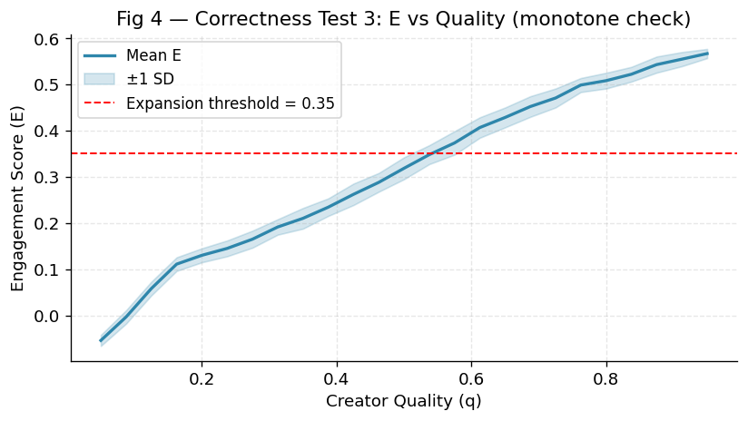
</p>

**Fig 4.** Mean `E` crosses the amplification threshold near `q ≈ 0.55`. This
one plot anchors every later interpretation: strategies with mean quality below
0.55 should rarely go viral *without* a trend boost, and those above it should
go viral routinely. Both predictions hold.

---

## Results

### Experiment 1 — follower growth distributions

<p align="center">
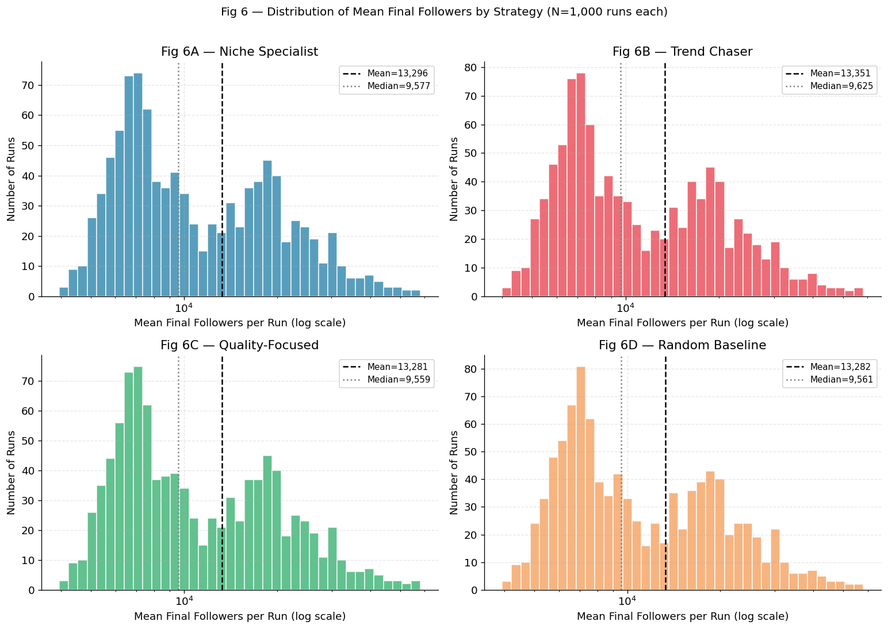
</p>

1,000 runs per strategy. The four histograms are close to indistinguishable —
means within 70 followers of each other, identical standard deviation (8,877)
and identical skewness (1.697) to three decimals.

**This is the central null result, and it is a modelling consequence, not a
plotting failure.** Creators start with a nontrivial follower stock drawn from
real tier shares, and churn operates on that stock. In that regime the run-level
mean is dominated by initialisation and churn balance, so strategies that act
*through virality* barely move it.

### Experiment 2 — survival and downside risk

<p align="center">
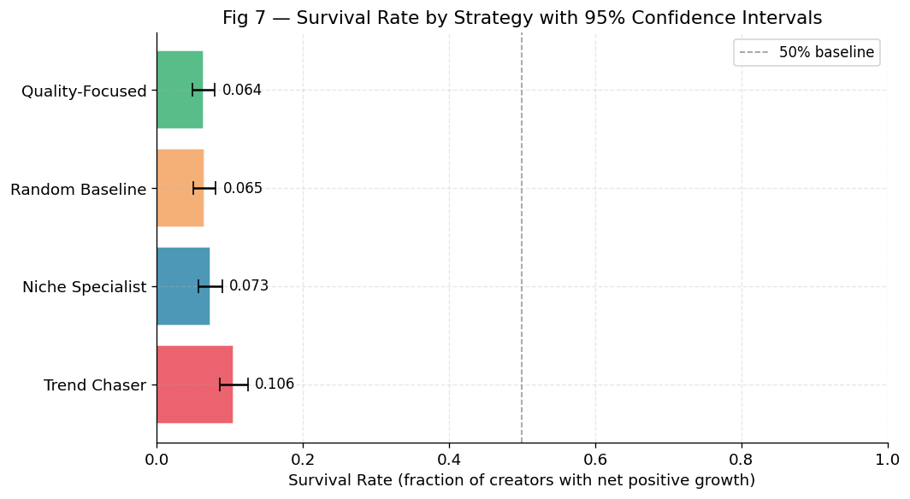
</p>

Survival is defined as a run ending with higher mean followers than it started:
`F̄(T) > F̄(0)`. It is low everywhere — churn wins most environments — but the
ranking is clear and the top-vs-bottom intervals do not overlap:

```
Trend Chaser 0.1056  >  Niche 0.0735  >  Random 0.0655  >  Quality-Focused 0.0640
```

This is counterintuitive only if you assume quality is the sole driver. Each
posted video draws its own fresh cohort and its own independent shot at the
threshold. The trend chaser posts three times a week against the
quality-focused creator's one, so a low per-video viral probability still
accumulates enough amplified impressions to offset churn more reliably.

### Experiment 3 — virality, simulation vs theory

<p align="center">
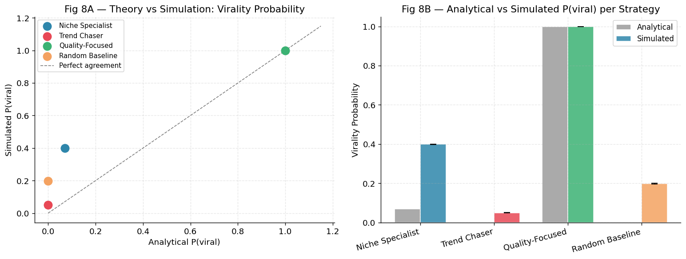
</p>

| Strategy | Theory | Simulated | Δ |
|---|---:|---:|---:|
| Quality-Focused | 1.0000 | 1.0000 | +0.0000 |
| Niche Specialist | 0.0703 | 0.3990 | **+0.3286** |
| Random Baseline | 0.0000 | 0.1980 | +0.1980 |
| Trend Chaser | 0.0000 | 0.0495 | +0.0495 |

Every strategy sits above the diagonal except quality-focused, which lands
exactly on `(1, 1)`. The deviation is *explained*, not waved at: the analytical
model evaluates engagement at a fixed quality and a baseline topic, and cannot
see that an active trend multiplies share probability by 1.4. That shifts the
whole score distribution up and pushes borderline videos over the line. The
effect is largest for mid-quality strategies — high quality is already over the
threshold, very low quality is still under it.

### Follow-up — is virality actually the mechanism?

<p align="center">
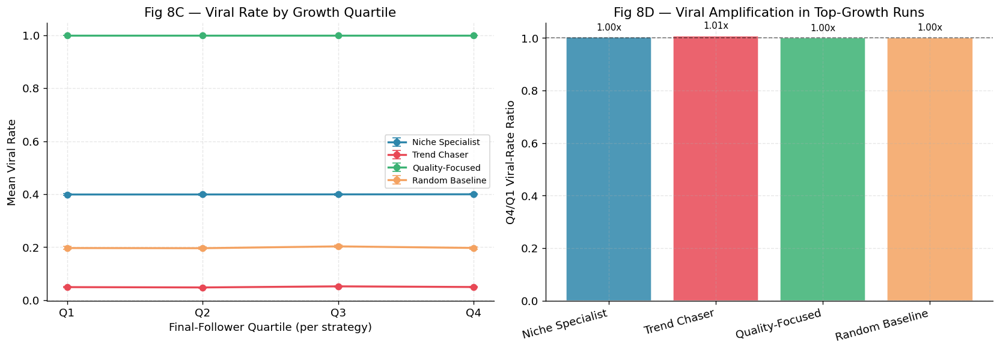
</p>

A tempting story: *the best runs are the ones where more videos went viral.*
Binning runs into quartiles by final followers and comparing viral rates
**rules it out.** Rates are flat from Q1 to Q4 within every strategy, with
Q4/Q1 ratios of 1.00–1.01. Run-to-run variation is driven by the initial
follower draw, not by within-run luck on virality.

This is the kind of result that only shows up if you go looking for it, and it
changes the interpretation of Experiment 1.

### Experiment 4 — inequality

<p align="center">
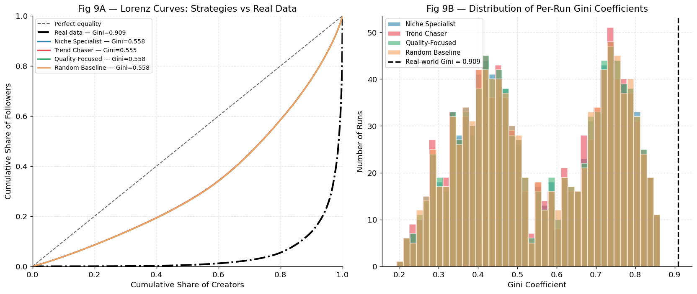
</p>

Three-way comparison, per strategy:

| | Theory (log-normal) | Simulated | Real |
|---|---:|---:|---:|
| Gini | ≈ 0.319 | ≈ 0.556 | **0.9086** |

Two honest gaps, each with a cause:

1. **Simulated > theory** because the simulation inherits variance from the
   initial follower distribution on top of multiplicative growth variance — the
   log-normal argument only accounts for the latter.
2. **Simulated ≪ real** because 30 creators per run cannot express the top-tail
   concentration visible in a 1,000-creator sample. This is a scale limitation,
   and it is reported as one rather than tuned away.

The model reproduces *substantial, strategy-independent* inequality from a
threshold feedback loop alone. It does not reproduce the real tail, and claiming
otherwise at N = 30 would be false.

### Experiment 5 — sensitivity

<p align="center">
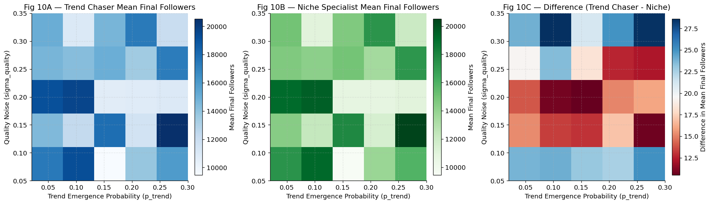
</p>

A 5×5 grid over trend frequency `p_trend ∈ [0.02, 0.30]` and quality noise
`σ_q ∈ [0.05, 0.35]`. Both strategies shift in the same direction across most
of the grid, so the **difference map is the informative panel** — and it
contains both red and blue regions. Neither strategy dominates uniformly;
which one wins depends on the regime.

### Confidence intervals as a result, not a footnote

<p align="center">
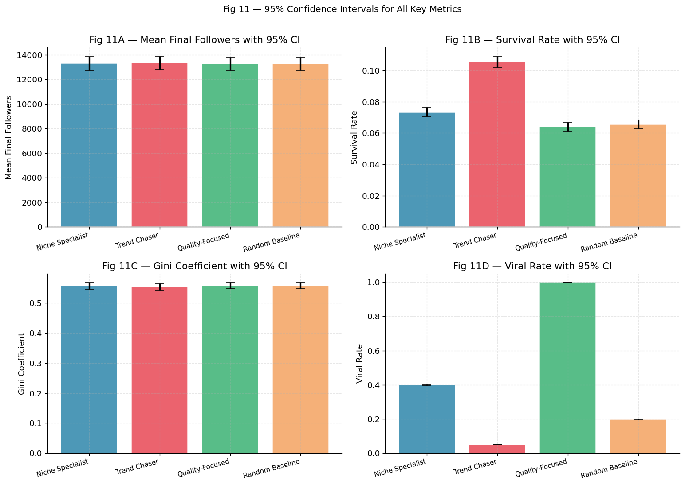
</p>

| Metric | CI width | Reading |
|---|---:|---|
| Mean final followers | ±1,101 | **Tied.** Any ranking by mean followers is not stable at N = 1,000. |
| Survival rate | ±0.006 | **Real but small.** Trend chaser vs quality-focused do not overlap. |
| Viral rate | ±0.003 | **The clean differentiator.** All four separate; quality-focused pinned at 1.0. |
| Gini | ±0.022 | **Tied.** Inequality is structural, not strategic. |

Halving these intervals would require 4,000 runs per strategy rather than 1,000.
That is stated rather than quietly ignored, because "the strategies are tied"
and "we did not run enough simulations to tell" are different claims, and only
the interval widths distinguish them.

---

## What this model cannot tell you

Stated plainly, because each limitation is tied to a specific result above.

1. **No learning.** Quality is fixed within a run, so the model cannot represent
   creators getting better. Adding a slow quality update would directly test
   whether quality-focused still dominates virality when skill can be acquired.
2. **No user network.** Viewers are sampled from a static distribution, not
   simulated as agents, so community-driven cascades are absent. Even a simple
   community graph would likely raise inequality — and would plausibly favour
   niche specialists specifically.
3. **Thirty creators per run.** This is why simulated Gini stalls at 0.556
   against a real 0.909. Scaling to 500–1,000 agents is the most direct test of
   whether the feedback loop alone can generate an ultra-heavy tail.
4. **One trend at a time.** A reasonable approximation of a dominant-trend
   regime, but it excludes overlapping cultural moments entirely.
5. **Threshold amplification is a caricature.** It captures a feedback loop. It
   is not a claim about how any real ranking system is implemented.

Results are conditional on a modelled platform, not measurements of the real
one. The right reading is "in a system with these mechanics, here is what
strategy does" — not "here is what TikTok does".

---

## Reproducing it

```bash
git clone https://github.com/rayyanmaan/viral-roulette.git
cd viral-roulette

python -m venv .venv && source .venv/bin/activate
pip install -e ".[dev]"

pytest                                    # 15 tests, ~30s
jupyter lab notebooks/viral_roulette.ipynb
```

The notebook runs top to bottom with no manual downloads — every dataset is in
`data/`, and paths resolve whether you run it from a local clone or from Colab
(Appendix A0 detects Colab and clones the repo itself).

Or drive the model directly:

```python
from viral_roulette import build_calibration, run_monte_carlo

cal = build_calibration()
res = run_monte_carlo("trend_chaser", cal, n_runs=1000, p_trend=0.12)

print(res["viral_rate"].mean())       # 0.0495
print(res["survival_rate"].mean())    # 0.1056
```

**Runtime.** Appendix A6 runs 4,000 full simulations, roughly 15–25 minutes on a
laptop. Everything before it runs in under a minute. Every run is seeded
(`base_seed + run_index`), so results are bit-reproducible and any individual
run can be replayed in isolation.

<details>
<summary><b>A reproducibility bug found while packaging this</b></summary>

The original calibration selected its 12 content topics with
`value_counts().head(12)`. Every one of the 60 hashtags in the dataset has
**exactly 20 rows**, so that call is a pure tie-break — and `value_counts()`
does not guarantee a stable order for ties across pandas versions. On the
pandas the analysis was originally run under it selected a humour-adjacent
cluster (`lmao`, `jokes`, `memes`, …); on pandas 2.3 it selects a different
twelve and shifts the baseline like rate from 0.1478 to 0.1388, propagating into
every downstream engagement probability.

The packaged version pins the published set in
[`PUBLISHED_TOPICS`](src/viral_roulette/calibration.py) and documents why, so
the numbers in the report reproduce on any pandas. Passing
`pinned_topics=None` restores the original frequency-ranked behaviour.

With the pin in place the full pipeline reproduces the published results
exactly — all four strategies, all four metrics, to four decimal places:

| Strategy | Mean F(T) | Survival | Gini | Viral rate |
|---|---:|---:|---:|---:|
| Niche Specialist | 13,296 | 0.0735 | 0.5577 | 0.3990 |
| Trend Chaser | 13,351 | 0.1056 | 0.5550 | 0.0495 |
| Quality-Focused | 13,281 | 0.0640 | 0.5584 | 1.0000 |
| Random Baseline | 13,282 | 0.0655 | 0.5585 | 0.1980 |

</details>

---

## Repository map

```
viral-roulette/
├── README.md
├── report/
│   ├── viral-roulette-report.pdf     16-page write-up, figures embedded
│   └── viral-roulette-report.tex     LaTeX source
├── notebooks/
│   └── viral_roulette.ipynb          full executable analysis, A0 → A11
├── src/viral_roulette/               the model, extracted as an installable package
│   ├── config.py                     strategies, sizing, funnel constants
│   ├── calibration.py                four datasets → model parameters
│   ├── creator.py                    Creator agent + Video record
│   ├── algorithm.py                  the two-stage recommendation funnel
│   ├── trends.py                     TrendEngine, log-normal lifecycles
│   ├── simulation.py                 one Monte Carlo trial
│   ├── montecarlo.py                 the single experiment entry point
│   ├── theory.py                     closed-form benchmarks
│   └── metrics.py                    Gini, Lorenz, confidence intervals
├── tests/                            15 tests: correctness, reproducibility, theory
├── data/                             all four datasets + provenance README
├── assets/figures/                   every figure, at publication resolution
└── docs/index.html                   the interactive funnel demo (GitHub Pages)
```

**Notebook ↔ package.** The notebook is the analysis of record and runs
standalone. The package is the same model extracted, documented and tested, so
the simulation can be imported and re-run without a notebook. The notebook's
appendix labels (A0–A11) are the cross-reference scheme the report cites.

---

## References

1. **Bright Data.** *TikTok user profiles dataset* (CSV, creator-level sample,
   n = 1,000). Used for the follower distribution, Lorenz curve and Gini
   calibration target. → Appendix A1a
2. **Kaggle (CC0).** *TikTok popular hashtags dataset* (XLSX, video-level
   engagement by hashtag, n = 1,200). Used for per-topic like/share multipliers
   and the funnel scale factors. → Appendix A1b
3. **Google Trends.** Weekly worldwide interest for Sea Shanty (Nov 2020 –
   Apr 2021), Corn Kid (Aug – Dec 2022), Brat Summer (May – Oct 2024) and
   Demure (Jul – Nov 2024). Used for log-normal lifecycle fitting.
   → Appendix A1c
4. **HypeAuditor (2026).** *State of Influencer Marketing 2026.* Used for the
   creator-tier distribution and engagement benchmarks by tier. → Appendix A1d
5. **Berry, A. C. (1941).** The accuracy of the Gaussian approximation to the
   sum of independent variates. *Transactions of the American Mathematical
   Society*, 49(1), 122–136. Justifies the normal approximation used for
   `P(viral)`.

Full provenance, columns used and licensing: [`data/README.md`](data/README.md).

---

<div align="center">

**Rayyan Maan** · MIT licensed · [Report](report/viral-roulette-report.pdf) · [Notebook](notebooks/viral_roulette.ipynb) · [Data](data/README.md)

</div>
